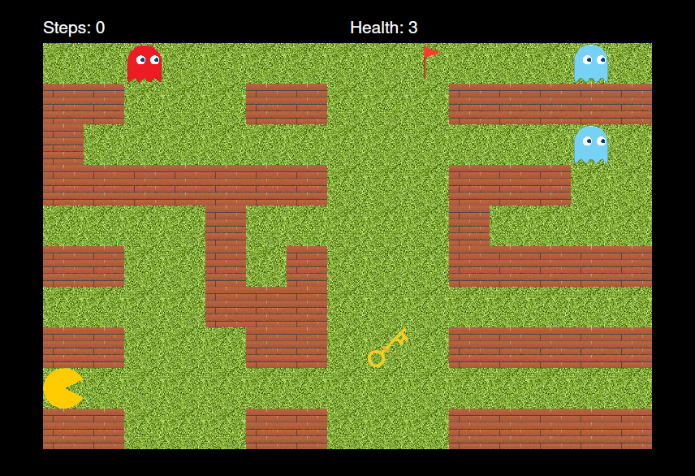

# Pac-Man

## April 2023

## Authors

- xkrato67
- 

## Screenshot

## Implementation

The result is a game created using the Qt framework in C++. The user uses a GUI
to interact with the game. The implementation utilizes the Model View Controller
(MVC) design pattern to separate the game model from the GUI. The game contains
three interactive elements:

- Counting user steps.
- Displaying current lives.
- Number of player attempts at the end of the round.

## Functionality

- Upon launching the application, you will be prompted to select a map.
  Subsequently, a map can be selected via the Game -> 'Load' button in the top
  bar, or by restarting the same map using 'Restart' after the game ends.
- The game state can be saved using the Game -> 'Save' button. It can then be
  loaded just like a standard map.
- After the game ends, the gameplay can be saved using the 'Save this gameplay'
  button and then replayed via the Game -> 'Replay' button.

## Limitations and bugs

- Pac-Man's movements are controlled only via WASD; arrow keys do not work.
- Only one replay mode was implemented - step-by-step stepping.
- The 'Save this gameplay' window appears as many times as you have clicked
  'Restart'.
