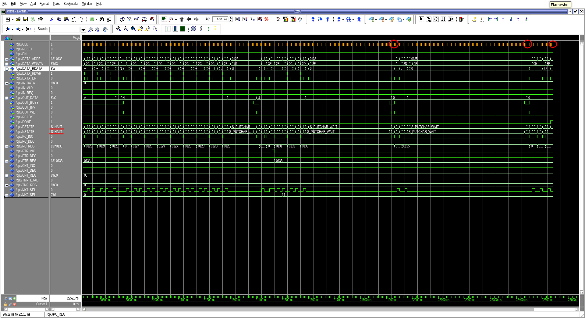

# 1. Brainfuck CPU interpreter

## November 2024

### Description

This project implements a soft-core processor in VHDL designed to natively
execute the Brainfuck esoteric programming language. The design utilizes a
behavioral model based on a Finite State Machine (FSM) to control the datapath.

### Results

# 2. Vigenère cipher in MIPS64

## December 2024

### Description

An implementation of the Vigenère cipher encryption algorithm written in MIPS64
Assembly language. The program processes an input string ("dmitriiivanushkin")
and encrypts it by applying a polyalphabetic substitution based on a specific
key pattern ("iva").
