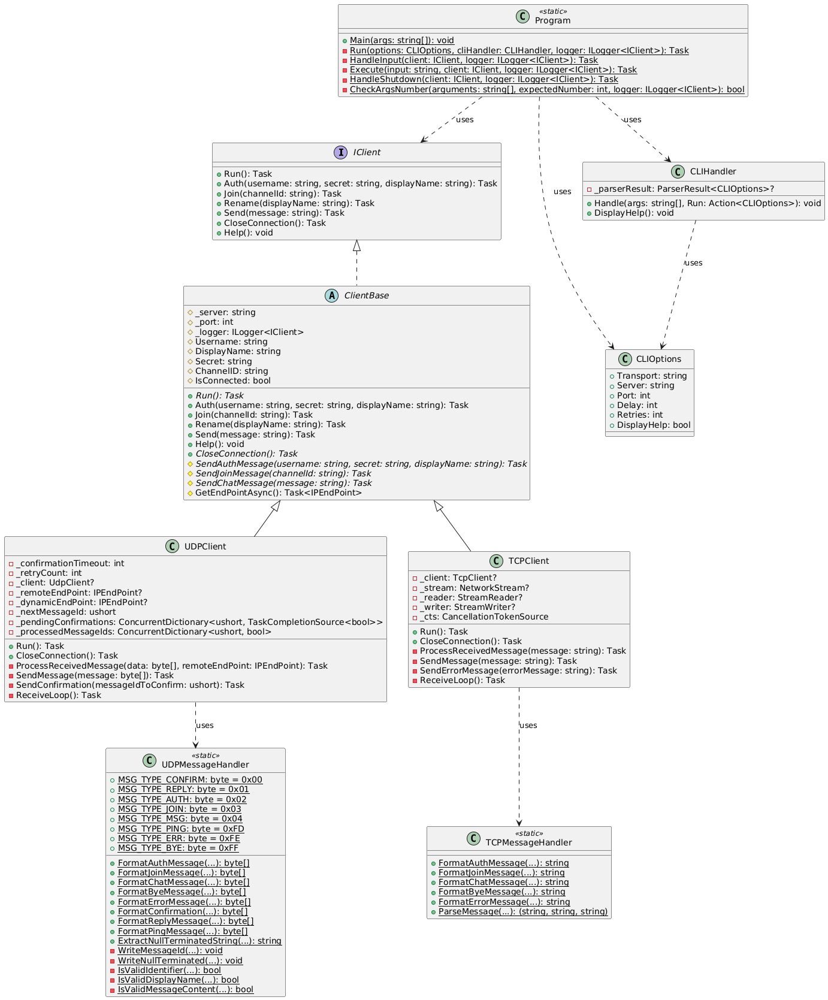

# Client for a chat server using the `IPK25-CHAT` protocol

## May 2025

## Table of Contents

- [Summary](#summary)
- [Usage](#usage)
  - [Prerequisites](#prerequisites)
  - [Running application](#running-application)
- [Theory](#theory)
- [Source code architecture](#source-code-architecture)
- [Testing](#testing)
- [Bibliography](#bibliography)

### Summary

The IPK25-CHAT protocol defines a high-level behaviour, which can then be
implemented on top of one of the well-known transport protocols such as TCP
[RFC9293] or UDP [RFC768] [1](#bibliography)

### Usage

#### Prerequisites

- .NET v9.0.203
- CommandLineParser v2.9.2
- Microsoft.Extensions.Hosting v9.0.4
- Microsoft.Extensions.Logging v9.0.4

#### Running application

I prepared `publish` variant to ensure that application behaves consistently on
all machines

```sh
make
```

If you prefer, you can also run

```sh
make build
```

And then run your application with .NET runtime, although I haven't tested this
option as heavily as `published` version

```sh
dotnet ./src/bin/Release/net9.0/ipk25chat-client.dll
```

### Theory

The application implements a chat client that supports both TCP and UDP
protocols. In TCP mode, it maintains a persistent connection with the server
using text-based messages. In UDP mode, it uses a more complex approach with
dynamic ports and message confirmation.

Both variants support basic chat operations (authentication, joining channels,
sending messages) but handle them differently due to the underlying protocol
characteristics.

### Source code architecture

I prepared this class diagram to show the main concept behind architecture. I
have a `Program.cs` that uses `Utils/` directory to parse incoming arguments
[2](#bibliography). It also defines aaplication logging through a Microsoft
extensions [5](#bibliography) I listed in [prerequisites](#prerequisites).
`Program.cs` initializes `TCPClient.cs` [3](#bibliography) or `UDPClient.cs`
[4](#bibliography), decides what to do with `stdin` input (sending a message vs
command) and handles graceful shutdown by <C-c> and <C-d> key presses.

Then based on `-t` flag after Network Client is being initialized, it starts to
parse user input and sending messages to a server. Both TCP and UDP clients have
their abstract `ClientBase` class, from which they inherit. They support basic
`Auth`, `Join`, `Rename` commands. They can also send plain messages, show
`Help` to a user and close connection with a server. Although the complete set
of commands works only in TCP variant. I describe this in a `CHANGELOG.md`.

Both `TCPClient.ts` and `UDPClient.cs` use `TCPMessageHandler.cs` and
`UDPMessageHandler.cs`. These files are located in a `Protocol` directory and
they define how exactly the messages that are being sent and received to/from a
server look like.

While I implemented the entire application myself, I used Claude AI assistant
[6](#bibliography) to help refactor large portions of the code to better align
with clean code principles. This included improving variable naming, reducing
code repetition, and enhancing overall code structure and readability.



### Testing

#### Initial Testing with Netcat

During early development, netcat was used to verify basic TCP functionality:

```bash
nc -l 4567

./ipk25chat-client -t tcp -s localhost -p 4567
```

For UDP testing:

```bash
nc -u -l 3000

./ipk25chat-client -t udp -s localhost -p 3000 -d 10000 -r 10
```

#### Unit Tests

Usage:

```sh
make test
```

Basic functionality tests using xUnit framework:

```csharp
[Fact]
public void TCPClientCreation() {
  Console.WriteLine("\n=== Testing TCP client creation with host=localhost, port=12345 ===");
  var client = new TCPClient("localhost", 12345, _logger);

  Assert.NotNull(client);
  // Client is created but not connected yet
}
```

#### Integration Testing

The main testing was performed against the reference server:

```bash
./ipk25chat-client -t tcp -s anton5.fit.vutbr.cz -p 4567
```

The TCP implementation proved fully functional with the reference server,
supporting all required features (authentication, channel operations,
messaging). The UDP implementation showed some limitations that I listed in
`CHANGELOG.md`

### Bibliography

1. NESFIT. IPK Project 2: Client for a chat server using the IPK25-CHAT
   protocol. Online. Dostupné z:
   https://git.fit.vutbr.cz/NESFIT/IPK-Projects/src/branch/master/Project_2#specification.
   [cit. 2025-04-20].
2. Command Line Parser Library for CLR and NetStandard. Online. Dostupné z:
   https://github.com/commandlineparser/commandline. [cit. 2025-04-20].
3. MICROSOFT. TCP overview. Online. Dostupné z:
   https://learn.microsoft.com/en-us/dotnet/fundamentals/networking/sockets/tcp-classes?source=recommendations.
   [cit. 2025-04-20].
4. MICROSOFT. UDP Client. Online. Dostupné z:
   https://learn.microsoft.com/en-us/dotnet/api/system.net.sockets.udpclient?view=net-9.0.
   [cit. 2025-04-20].
5. NESFIT. IPK 2024/2025 guideline. Online. Dostupné z:
   https://git.fit.vutbr.cz/NESFIT/IPK-Projects. [cit. 2025-04-20].
6. ANTHROPIC. Claude AI Assistant. Online. Dostupné z:
   https://www.anthropic.com/claude. [cit. 2025-04-20].

\* [Citace PRO guideline](https://www.citacepro.com)
