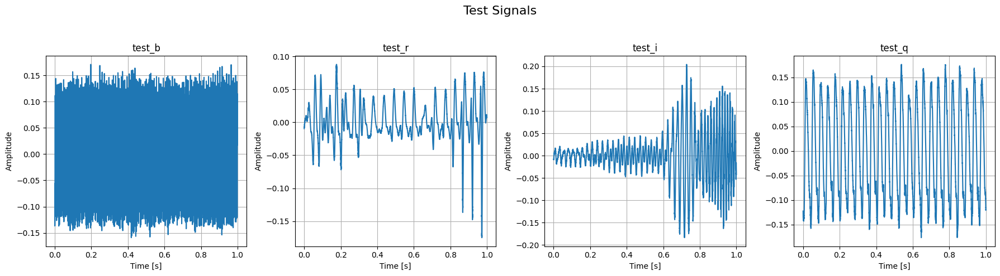
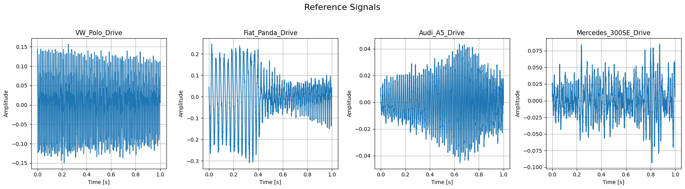
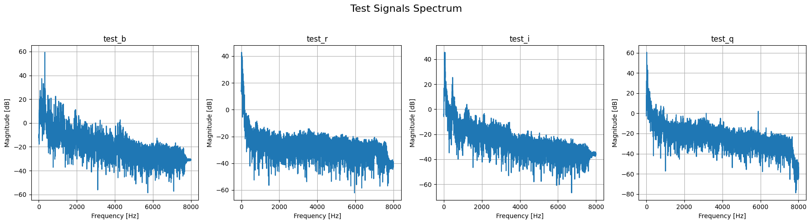
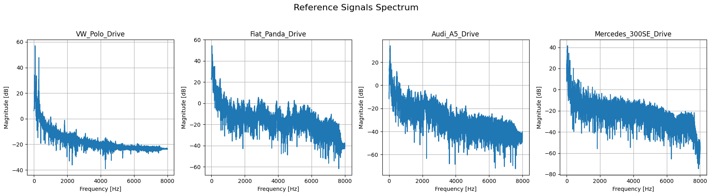
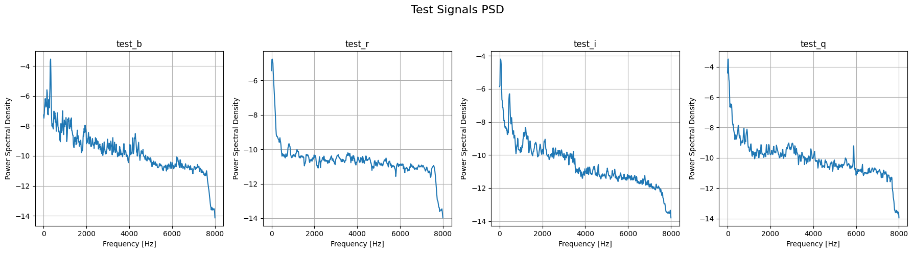
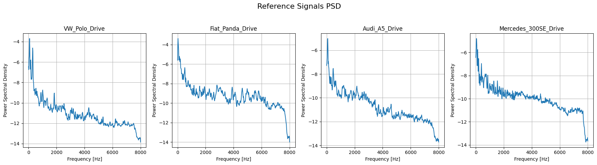
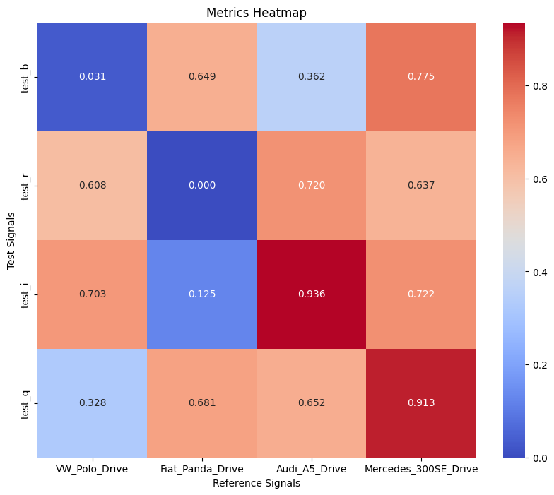

# You can tell by their voice...

## November 2024

### Motivation

One is able to identify the source of the sound by the sound. We can tell a guitar from a piano, a saxophone or an organ. We can safely distinguish the sound a dog makes from the sound a cat makes. Dog owners can distinguish their dog's bark from other dogs, and lovers of songbirds can tell the species of songbird by its song. We know the sound of a truck from a car. We know our friends by their voices. We hear the difference in sounds and can match them to their source or to each other.

And if a slow and imperfect biological human with his ear has such abilities, surely it will be no problem for an infinitely faster and more accurate computer equipped with high quality sensors... Well, we won't go that far, we've separated quality sensors and sound recording from processing, so you won't have to run around Brno recording all sorts of sounds. We have prepared for you engine sounds of several car models at different speeds.

Your task will be to automatically match the recordings coming from one car model. Don't worry, one car is used for all recordings of a given model, so there is no difference between two cars caused by the mileage of the engine or how the owner treated it at the time of the previous recording.

### Implementation

#### Preparations

##### 1.1 Import libraries

``` python
import os
import re
import glob
import soundfile as sf
from IPython.display import Audio
from IPython.display import display
from scipy import signal as scsig
from scipy.io import wavfile
from scipy.fft import fft, ifft, fftfreq
import scipy.io
import matplotlib.pyplot as plt
import numpy as np
import seaborn as sns
```

##### 1.2 Download the zip file

``` python
login = "xivanu00"
zip_file = login + ".zip"
assignment_file = "https://********/" + zip_file
!wget $assignment_file
!unzip -o $zip_file
```

    Archive:  xivanu00.zip
      inflating: xivanu00/Audi_A5_Drive.wav  
      inflating: xivanu00/test_i.wav     
      inflating: xivanu00/VW_Polo_Drive.wav  
      inflating: xivanu00/test_b.wav     
      inflating: xivanu00/Fiat_Panda_Drive.wav  
      inflating: xivanu00/test_q.wav     
      inflating: xivanu00/Mercedes_300SE_Drive.wav  
      inflating: xivanu00/test_r.wav     

##### 1.3 Load data

-   **Working with references**<br />
    References will be in `ref_signals` <br />
    Reference labels in `ref_labels`<br />
    Reference count in `N_ref`

-   **Working with tests**<br />
    Tests will be in `test_signals`<br />
    Test labels in `test_labels`<br />
    Test count in `N_test`
    
``` python
def get_signals(labs):
  signals = []
  N = len(labs)
  for car in labs:
    filename = login + "/" + car + ".wav"
    s, Fs = sf.read(filename)
    signals.append(s)
  return signals, N, Fs

files = glob.glob(login + "/*.wav")
names = [re.sub(login + "/", "", s) for s in files]
labels = [re.sub(".wav", "",s) for s in names]

print ("----- test signals ---------")
r = re.compile("^test_")
test_labels = list(filter(r.match, labels))
test_signals, N_test, Fs_test = get_signals(test_labels)

print (test_labels)

print ("----- reference signals ---------")
r = re.compile("(?!^test_)")
ref_labels = list(filter(r.match, labels))
ref_signals, N_ref, Fs_ref = get_signals(ref_labels)

print (ref_labels)
```

#### Visualizing raw data

##### 2.1 Create `draw_plot` decorator for convenience

``` python
def draw_plot(draw_func):
  def wrapper(signals, Fs, labels, title):
    num_plots = len(signals) # 4 for each suite
    fig, axes = plt.subplots(1, num_plots, figsize=(18, 5))
    axes = axes.flatten()

    # Draw each signal
    for idx, signal in enumerate(signals):
      draw_func(signal, Fs, axes[idx], labels[idx])

    # Setup
    fig.suptitle(title, fontsize=16)
    plt.tight_layout()
    plt.subplots_adjust(top=0.8)
    plt.show()
    print("")
  return wrapper
```

##### 2.2 Visualize raw signals

I'll start with drawing plots of raw signals. I'll use subplots for each one of `test_signals` and `ref_signals`

-   **x-axis**<br />
    Time `t` [s] (always 1s, but I calculate it using formula `t = n / Fs`)

-   **y-axis**<br />
    Amplitude of `signal`

``` python
def get_t(signal, Fs):
  N = len(signal)
  n = np.arange(0, N)
  t = n / Fs
  return t

@draw_plot
def draw_raw_signal(signal, Fs, ax, label):
  t = get_t(signal, Fs)

  ax.plot(t, signal)
  ax.set_title(label)
  ax.set_xlabel('Time [s]')
  ax.set_ylabel('Amplitude')
  ax.grid(True)

draw_raw_signal(test_signals, Fs_test, test_labels, "Test Signals")
draw_raw_signal(ref_signals, Fs_ref, ref_labels, "Reference Signals")
```




##### 2.3 Visualize magnitude with FFT

Now I would like to perform the Fast Fourier Transform (FFT) to analyze
the frequencies of reference and test audio signals. I decided to start
with it because audio signals should contain periodic patterns that we
can compare later on.

-   **x-axis**<br />
    Frequencies [Hz] that are present in a `signal`

-   **y-axis**<br />
    Magnitude [dB] that shows strength of frequencies. Higher magnitudes indicate dominant frequencies in a `signal`.

``` python
def get_fft(signal, T):
  # Use built-in FFT from numpy to get spectrum
  spectrum = np.fft.fft(signal)
  # Use built-in function to extract frequencies from the signal
  freqs = np.fft.fftfreq(len(signal), T)
  positive_freqs = freqs[:len(freqs)//2] # Use only positive (second half)
  magnitude = 20 * np.log10(np.abs(spectrum[:len(freqs)//2])) # Use dBs for Magnitude representation
  return positive_freqs, magnitude

@draw_plot
def draw_fft_spectrum(signal, Fs, ax, label):
  positive_freqs, magnitude = get_fft(signal, 1/Fs)

  # Setup
  ax.plot(positive_freqs, magnitude)
  ax.set_title(label)
  ax.set_xlabel('Frequency [Hz]')
  ax.set_ylabel('Magnitude [dB]')
  ax.grid(True)

draw_fft_spectrum(test_signals, Fs_test, test_labels, "Test Signals Spectrum")
draw_fft_spectrum(ref_signals, Fs_ref, ref_labels, "Reference Signals Spectrum")
```




From the plots printed above I can tell at a glance that this
represenation of tests and references has similarity in some cases.
These could turn out to be totally wrong in the end:

-   **test_q** and **Mercedes_300SE_Drive** spectra have a similar "sliding down" after about 7000 Hz
-   **test_r** and **Fiat_Panda_Drive** spectra also have similar slidings that \"flatten\" around 8000 Hz

Other plots don't share such obvious similarities to speak definitively.

##### 2.4 Visualize PSD

Before I start extracting features and making further comparisons, I
would like to try Power Spectral Density (PSD) instead of a classic raw
FFT. It *should* be able to reduce noise, better highlight
concentrations of frequencies and overall give a better comparison. I
use built-in function from `scipy.signal` that applies **Welch\'s
method** to extract PSD by windowing each sample (I divided signal to
1024 of them) and then I convert the PSD to a logarithmic scale for
better visualization and comparison.

-   **x-axis**</br>
    Frequencies \[Hz\] that are present in a `signal`

-   **y-axis**</br>
    Power Spectral Density that shows how much of the signal\'s energy resides at specific frequencies.

``` python
def get_psd(signal, Fs):
  # Use built-in PSD extraction (Welch's method)
  frequencies, psd = scsig.welch(signal, Fs, nperseg=1024)
  # Scale logarighmically
  psd = np.log10(psd)
  return frequencies, psd

@draw_plot
def draw_psd(signal, Fs, ax, label):
  frequencies, psd = get_psd(signal, Fs)

  ax.plot(frequencies, psd)
  ax.set_title(label)
  ax.set_xlabel('Frequency [Hz]')
  ax.set_ylabel('Power Spectral Density')
  ax.grid(True)

draw_psd(test_signals, Fs_test, test_labels, "Test Signals PSD")
draw_psd(ref_signals, Fs_ref, ref_labels, "Reference Signals PSD")
```




#### Choosing similarity metric and making comparisons

##### 3.1 Choose a metric

In this last segment I need to decide which metric I want to use for my
task. I decided to go with **Mean Squared Error** (MSE). MSE calculates
how much the frequency content of one signal deviates from the other.
For convenience I normalize MSE so after it, higher values in the
`combined_matrix` represent less difference between the signals, meaning
they are more similar, and lower values mean the signals are less similar.

``` python
def calculate_combined_score(signal1, signal2, Fs, max_mse):
  _, psd1 = get_psd(signal1, Fs)
  _, psd2 = get_psd(signal2, Fs)

  mse = np.mean((psd1 - psd2) ** 2) # Get mse
  mse_norm = 1 - (mse / max_mse) # Normalize using max value

  return mse_norm

def compute_max_mse(test_signals, ref_signals, Fs):
  max_mse = 0
  for signal1 in test_signals:
    for signal2 in ref_signals:
      _, psd1 = get_psd(signal1, Fs)
      _, psd2 = get_psd(signal2, Fs)
      mse = np.mean((psd1 - psd2) ** 2) # Get mse
      max_mse = max(max_mse, mse) # Get max
  return max_mse

def create_combined_matrix(test_signals, ref_signals, Fs):
  max_mse = compute_max_mse(test_signals, ref_signals, Fs)

  # Add scores to each cross of test and ref signals
  combined_matrix = np.zeros((len(test_signals), len(ref_signals)))
  for i, test_signal in enumerate(test_signals):
    for j, ref_signal in enumerate(ref_signals):
      combined_matrix[i, j] = calculate_combined_score(test_signal, ref_signal, Fs, max_mse)

  return combined_matrix
```

##### 3.2 Visuallize matrix and make predictions

Now when I have combined matrix I can easily visualize it with a **heatmap** and use it assigning signal pairs.

``` python
def plot_heatmap(matrix, test_labels, ref_labels, title, xlabel, ylabel):
  plt.figure(figsize=(10, 8))
  sns.heatmap(matrix, annot=True, fmt=".3f", cmap="coolwarm", xticklabels=ref_labels, yticklabels=test_labels)
  plt.title(title)
  plt.xlabel(xlabel)
  plt.ylabel(ylabel)
  plt.show()

def assign_signals(combined_matrix, test_labels, ref_labels):
  assignments = {}

  for i, test_label in enumerate(test_labels):
    max_score_idx = np.argmax(combined_matrix[i])
    max_score = combined_matrix[i, max_score_idx]

    # Threshold = 0.9
    if max_score >= 0.9:
      assignments[test_label] = ref_labels[max_score_idx]
    else:
      assignments[test_label] = "No match"

  return assignments

combined_matrix = create_combined_matrix(test_signals, ref_signals, Fs_test)
plot_heatmap(combined_matrix, test_labels, ref_labels, "Metrics Heatmap", "Reference Signals", "Test Signals")
assignments = assign_signals(combined_matrix, test_labels, ref_labels)

print("")
for test_signal, assignment in assignments.items():
  print(f"Test Signal: {test_signal} -> {assignment}")
```




    Test Signal: test_b -> No match
    Test Signal: test_r -> No match
    Test Signal: test_i -> Audi_A5_Drive
    Test Signal: test_q -> Mercedes_300SE_Drive

##### 3.3 Aftermath

So, the results aren\'t too exciting. I think I correctly identified
`test_i` (Audi) and `test_q` (Mercedes), but there should be the third
car. I tried to use different metrics like **Euclidean distance**,
**Cross-correlation coefficient** etc. I also tried to combine multiple
metrics and adjust weights when I was calculating `combined_matrix`, but
again I had no luck. There could be of course a problem with the signals
preprocessing. Maybe I needed to apply filter, smoothen data or increase
`nperseg` value while calculating PSD
