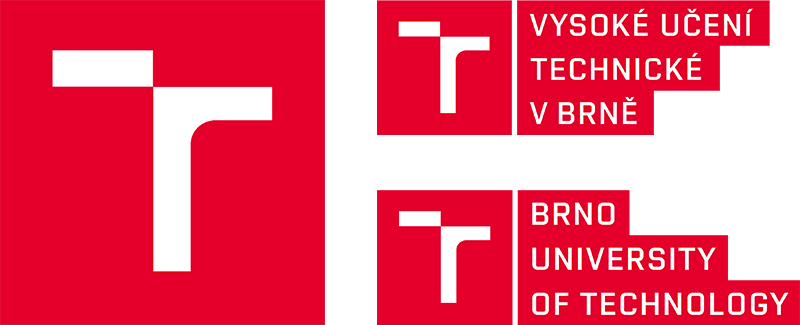

  

  

# Brno University of Technology Projects List

This repository contains various projects I worked on during my time at **Brno
University of Technology**, between 2021 and 2026. You can find all information
about the projects in the respective `README.md` files inside each course
folder.

## 📁 Projects List

Here is a list of the courses and their respective projects status (which
basically means that code is usable):

| Course Code | Course Name                                | What I created                       |
| ----------- | ------------------------------------------ | ------------------------------------ |
| IAL         | Algorithms                                 | Algorithms                           |
| ICP         | The C++ Programming Language               | Pac-Man                              |
| IDS         | Database Systems                           | Pharmacy DB                          |
| IFJ         | Formal Languages and Compilers             | Zig compiler                         |
| IMP         | Microprocessors and Embedded Systems       | Simple HW alarm                      |
| IMS         | Modelling and Simulation                   | Queueing system model                |
| INC         | Digital Systems Design                     | Circuit design                       |
| INP         | Design of Computer Systems                 | Brainfuck compiler, Vigenère encoder |
| IOS         | Operating Systems                          | Semaphores, Crypto exchange script   |
| IPK         | Computer Communications and Networks       | Client for a chat server             |
| IPP         | Principles of Programming Languages        | Custom language toolchain            |
| ISA         | Network Applications and Administration    | Filtering DNS resolver               |
| ISC         | PC Seminar                                 | Palindrome finder                    |
| ISJ         | Scripting Languages                        | Python scripts                       |
| ISS         | Signals and Systems                        | Car engines audio processor          |
| IZG         | Computer Graphics                          | Shaders                              |
| IZLO        | Introduction to Logic for Computer Science | SAT and SMT solvers                  |
| IZP         | Introduction to Programming Systems        | Password checker                     |

## 📜 Regarding License(s)

- Some files have Licenses specified in headers, some do not. If you do not see
  a License in header this is _probably_ file I wrote myself
- Some projects contain code provided by professors, identifiable by comments in
  the source files.
- Several projects were team-based. When applicable, I credit my collaborators
  with their GitHub profiles in the corresponding `README.md` files.

- **Note:** Usage of this code may be restricted due to the inclusion of
  professor-contributed code and team project work.

> **IMPORTANT: Do not reuse this code to avoid plagiarism issues.**
